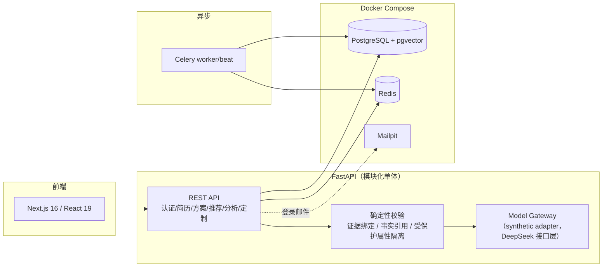

# CareerCopilot

> AI 求职助手 · 个人作品集项目 —— 展示「负责任 AI 工程」的完整实现：
> 简历解析 → 求职方案 → 可解释岗位匹配 → AI 分析 → 定制简历导出，全链路证据绑定、隐私红线内建。

本项目定位为**个人作品集**（见 [ADR-003](docs/14-adr-003-portfolio-pivot.md)），不以上线运营为目标。
评价标准：**陌生人 5 分钟跑起来、10 分钟看懂亮点**。所有演示数据均为合成，能力现状如实声明（见下表），不夸大。

---

## 一键 Demo

```bash
git clone <本仓库> && cd career-copilot
./demo.sh
```

一条命令拉起全套：PostgreSQL(pgvector)/Redis/Mailpit 容器 → 数据库迁移 → 幂等种子数据 → FastAPI + Celery worker/beat + Next.js 前端。macOS 实测（依赖就绪时）**8.4 秒**全套就绪。

启动完成后按屏幕提示登录：

| 项目 | 值 |
|---|---|
| 前端 | http://localhost:3000 |
| 后端 API | http://localhost:8000（健康检查 `/health/ready`） |
| Mailpit（收登录邮件） | http://localhost:8025 |
| 演示账号 | `demo@careercopilot-demo.dev` + 邀请码 `DEMO-LOGIN-2026` |

演示账号走**正常邀请码 + 邮箱 magic link 流程，没有任何认证后门**（[backend/app/demo/seed.py](backend/app/demo/seed.py)）。登录后可查看种子推荐、逐条证据、触发分析与定制简历导出。停止：`./demo.sh stop`。

- 前置依赖：docker、uv、node/npm。
- Windows：提供等价脚本 [demo.ps1](demo.ps1)，**尚未在真机验证**，遇到问题请以 demo.sh 逻辑为准。

## 能力现状（如实声明）

作品集的可信度来自不夸大。下表区分「真实执行」与「合成替身」：

| 能力 | 现状 | 说明 |
|---|---|---|
| 认证 / 授权 / 注销硬删除 | ✅ 真实执行 | 邀请码 + 邮箱免密登录、RBAC、7 天注销状态机与到期清理 |
| 简历解析（PDF/DOCX）→ 事实确认 | ✅ 真实执行 | 未经用户确认的事实不进入最终事实库 |
| 岗位匹配（硬条件 + 向量 + 评分） | ✅ 真实执行 | pgvector 真实检索；评分证据组件可逐条溯源 |
| 岗位供给 | ✅ 用户导入 + 合成种子 | 无爬虫/连接器（ADR-003 明确不做）；种子岗位 DB 层 `data_origin='synthetic_seed'` + 前端「合成示例」徽标双重标注 |
| Embedding 向量 | ⚠️ 确定性合成 | 检索链路真实，向量本身由确定性合成 Adapter 生成 |
| AI 标准分析 / 多 Agent | ⚠️ 合成响应 | 走真实编排与证据校验管线，模型输出为 synthetic adapter；**真实 DeepSeek 调用未验证** |
| 定制简历生成 + DOCX/PDF 导出 | ⚠️ 生成合成、校验真实 | 事实引用/数字一致性等确定性校验与导出为真实执行 |
| 真实 LLM（DeepSeek）全链路 | ❌ 未验证（`not_verified`） | 计划中的 P0（[docs/15](docs/15-portfolio-convergence-plan.md)），待 API key 到位后实跑并留证 |
| 邮件送达 | 本地 Mailpit 捕获 | 不做真实外网送达 |
| 云端部署 / Beta | ❌ 不做 | 作品集定位，仅本地演示（可选公开部署见 docs/15 P3，未启动） |

## 工程质量（数字均可复验）

| 指标 | 结果 | 复验命令 |
|---|---|---|
| 后端测试 | **pytest 295 passed**（286 存量 + 9 项 P1 新增） | `cd backend && uv run pytest` |
| 类型检查 | **mypy 0 错误 / 116 个源文件**，无以 `Any`/`type: ignore` 掩盖 | `cd backend && uv run mypy app` |
| Lint | ruff 全过 | `cd backend && uv run ruff check .` |
| CI | 三 job：后端(ruff+pytest) / 前端(lint+build) / 密钥扫描(gitleaks)，PR #1、#2 实际全绿 | [.github/workflows/ci.yml](.github/workflows/ci.yml) |

### 亮点（每条带仓库内证据）

1. **证据绑定防幻觉**：AI 分析报告的每条主张必须引用输入文档中真实存在的 fact_id / 岗位原文 span，虚构引用被确定性拦截（[backend/app/agents/service.py](backend/app/agents/service.py) `validate_report_evidence`）；定制简历生成与导出前各跑一次确定性事实引用校验，校验失败明确 failed、绝不落半成品（[backend/app/tailoring/service.py](backend/app/tailoring/service.py)、[validation.py](backend/app/tailoring/validation.py)）。
2. **受保护属性对偶测试**：性别、年龄、婚育、民族等受保护属性禁止进入向量文本与评分（[backend/app/matching/vector_text.py](backend/app/matching/vector_text.py)），并以对偶（counterfactual）测试保证「改变受保护属性，评分不变」（[backend/tests/test_scoring.py](backend/tests/test_scoring.py)、[test_evaluation_baseline.py](backend/tests/test_evaluation_baseline.py)）。
3. **跨用户隐私修复（含历史数据清理）**：发现私有岗位可能进入他人推荐后，不仅堵住候选池，还用迁移清理了历史泄露记录并给推荐读取接口补了可见性校验（[backend/alembic/versions/20260730_e5a7c9d2b4f6_purge_cross_user_recommendations.py](backend/alembic/versions/20260730_e5a7c9d2b4f6_purge_cross_user_recommendations.py)）。
4. **合规核查如实报告**：岗位来源 Spike 对 10 家目标公司官网做了可采集性核查，结果 0/10 通过（9 家 not_verified、1 家 blocked），报告原样保留、结论不追改（[supply-spike/reports/](supply-spike/reports/)、[ADR-002](docs/13-adr-002-supply-spike-gate.md)）——据此才有 ADR-003 的作品集转向决策。
5. **合成数据双重标注**：种子岗位在数据库层 `data_origin` 受控字段（[迁移](backend/alembic/versions/20260730_f7c1a3e9d5b8_canonical_jobs_data_origin.py)）与前端「合成示例」徽标（[RecommendationCard](frontend/src/components/RecommendationCard.tsx)、[详情页](frontend/src/app/recommendations/%5Bid%5D/page.tsx)）同时标注，不允许只有内部标记。
6. **日志无正文红线**：结构化日志不含简历/聊天正文、联系方式、token、密钥（[backend/app/core/logging.py](backend/app/core/logging.py)）。

## 架构



**技术栈**：Python 3.12 · FastAPI · SQLAlchemy/Alembic · PostgreSQL + pgvector · Redis · Celery · Next.js 16 · React 19 · TypeScript · Docker Compose · GitHub Actions。

## 隐私设计红线

- 受保护属性（性别/年龄/婚育/民族等）不进入评分、向量文本与任何 Prompt。
- 日志零正文：简历、聊天内容、联系方式、密钥不落日志。
- 账号可注销：7 天冷静期状态机 + 到期**硬删除**（含派生数据清理，[backend/app/privacy/](backend/app/privacy/)）。
- 完整简历发给任何第三方模型前需分别、主动、明确授权，默认不勾选。

## 文档索引

| 文档 | 内容 |
|---|---|
| [01 PRD](docs/01-prd.md) / [02 架构](docs/02-architecture.md) / [03 数据模型](docs/03-data-model.md) / [04 API](docs/04-api.md) / [05 UI/UX](docs/05-ui-ux.md) | 产品与系统设计基线 |
| [06 岗位来源](docs/06-job-sources.md) / [07 匹配与 Agent](docs/07-ai-matching-agents.md) | 供给与 AI 设计 |
| [08 安全与隐私](docs/08-security-privacy.md) / [09 测试与评测](docs/09-testing-evaluation.md) / [10 成本运维](docs/10-cost-operations.md) | 质量与合规设计 |
| [11 实施计划](docs/11-delivery-plan.md)（运营条目已标注 `dropped_portfolio_pivot`） | 历史交付计划，保留决策轨迹 |
| [12 ADR-001](docs/12-adr-001-mvp-decisions.md) / [13 ADR-002](docs/13-adr-002-supply-spike-gate.md) / [14 ADR-003](docs/14-adr-003-portfolio-pivot.md) | 关键决策记录 |
| [15 作品集收敛计划](docs/15-portfolio-convergence-plan.md) | 当前执行路线（P-1 → P1 → P0 → P2 → P3） |
| [验收报告](docs/acceptance-report.md) | 阶段 1～9 历史验收证据（基线 `12be67e`，保持原样） |
| [DEVELOPMENT.md](DEVELOPMENT.md) | 开发环境与常用命令 |

## 许可与免责声明

- **许可**：本仓库暂未附带开源许可证，默认保留所有权利；仅供学习与作品集展示，如需其他用途请先联系作者。
- **合成数据**：仓库内全部岗位、公司、简历、人物均为合成内容，不对应任何真实在招岗位或真实个人；如有雷同纯属巧合。
- **非求职建议**：本项目的匹配分数、分析报告与定制简历均为技术演示产物（当前 LLM 输出为合成响应），**不构成任何求职、职业或法律建议**，请勿据此做出实际求职决策。
- **非商用服务**：本项目不是运营中的产品，不提供可用性、准确性或数据留存承诺。
