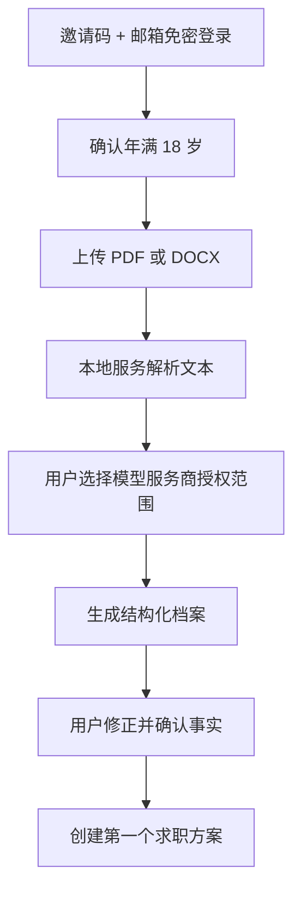

# 01. 产品需求文档（PRD）

## 1. 文档状态

- 产品代号：CareerCopilot
- 基线日期：2026-07-28
- 目标版本：Local MVP → Closed Beta
- 实施资源：一名偏 Python 的全栈开发者
- 本地 MVP 目标周期：10～12 周

## 2. 问题与价值主张

目标用户面对的核心问题不是“不会打开招聘网站”，而是：

- 多个平台和企业官网的岗位分散、重复、过期。
- 岗位要求写法不统一，用户难以判断是否值得投递。
- 传统关键词匹配忽略项目证据、技能迁移和轻微经验差距。
- 通用简历没有针对具体岗位突出相关事实。
- AI 改简历容易虚构数字、技能和经历。

CareerCopilot 的价值是主动发现岗位，并基于用户已确认的事实提供可解释推荐和可信的岗位定制简历。

## 3. 目标用户

### 3.1 主要用户

- 年龄：18 岁以上。
- 经验：1～5 年。
- 市场：中国大陆全职技术岗位。
- 城市：北京、上海、深圳、杭州、广州、成都。
- 方向：
  1. AI 应用开发 / 大模型应用工程师
  2. Python 后端开发
  3. Java 后端开发
  4. 前端开发
  5. 数据分析 / 数据工程
  6. 软件测试 / 测试开发

### 3.2 Beta 规模

- 首批 5～10 人验证流程与严重缺陷。
- 扩展到 20～50 人验证推荐质量和持续使用意愿。
- 用户来源优先为项目负责人、朋友和同事。

## 4. 产品目标

| ID | 目标 | 优先级 |
|---|---|---|
| G-01 | 用户能够从简历建立可修正、可追溯的事实库 | MUST |
| G-02 | 系统每天主动发现、标准化和去重岗位 | MUST |
| G-03 | 推荐结果同时满足硬条件、语义相关性和可解释性 | MUST |
| G-04 | 每个结论可追溯到简历或岗位原文证据 | MUST |
| G-05 | 生成岗位定制简历但不虚构任何事实 | MUST |
| G-06 | 缺失技能只提供免费、可信的学习入口 | SHOULD |
| G-07 | 通过显式反馈持续调整推荐偏好 | MUST |
| G-08 | 在每月 500 元以内支撑 20～50 人封闭 Beta | MUST |

## 5. Non-goals（第一版明确不做）

- 自动投递简历或代替用户登录招聘平台。
- 绕过验证码、登录限制、robots/访问政策或反爬措施。
- 面试和申请进度管理。
- 邮件、短信、微信提醒；只做站内通知。
- 微信小程序、原生 App。
- 支付、订阅和企业招聘方账号。
- 英文简历完整优化；只识别常见英文技术术语。
- 图片/扫描版简历 OCR。
- 实习、兼职、自由职业岗位。
- 付费企业征信 API、在线课程、练习或测验。
- 让 Agent 无确认地修改事实、删除数据或执行外部申请。

多 Agent 深度分析属于第一版范围，但必须遵守 [07-匹配与 Agent](07-ai-matching-agents.md) 的成本与权限边界。

## 6. 核心用户旅程

### 6.1 首次建档

解析结果在用户确认前属于“候选事实”，不得直接进入最终简历或自动匹配事实库。

### 6.2 每日搜岗与推荐

1. 每天运行一次合规岗位采集任务。
2. 标准化公司、岗位、城市、薪资、经验、学历和用工类型。
3. 合并跨来源重复岗位，保留所有来源链接。
4. 先执行硬条件过滤，再执行向量召回和综合评分。
5. 每个求职方案最多产生 20 个新推荐。
6. 每个账号每天选择 3 个最高价值岗位自动进行多 Agent 深度分析。
7. 用户通过站内通知和推荐列表查看结果。

### 6.3 岗位分析与反馈

- 80～100：高匹配。
- 65～79：可以尝试，必须突出差距。
- 低于 65：默认隐藏，用户可主动查看。
- 用户选择“感兴趣”或“不感兴趣”；不感兴趣需选择原因。
- 分数代表适配度，不得描述为面试或录用概率。

### 6.4 岗位定制简历

1. 用户打开岗位并请求生成定制版本。
2. 系统只使用已确认事实。
3. 缺失量化成果时向用户提问，不估算数字。
4. 展示逐项修改前后、理由与证据。
5. 用户逐项接受/拒绝并编辑。
6. 使用标准单栏模板导出 DOCX/PDF。
7. 每位用户每天最多创建 3 个新的岗位定制版本。

## 7. 功能需求

### 7.1 账号与权限

| ID | 需求 | 优先级 |
|---|---|---|
| FR-AUTH-01 | 邀请码 + 邮箱验证码或免密链接注册登录 | MUST |
| FR-AUTH-02 | 注册前确认年满 18 岁，不收集身份证 | MUST |
| FR-AUTH-03 | 登录链接短时有效、单次使用、支持撤销会话 | MUST |
| FR-AUTH-04 | 用户与管理员角色严格隔离 | MUST |

### 7.2 简历与事实库

| ID | 需求 | 优先级 |
|---|---|---|
| FR-RES-01 | 支持文本型 PDF 和 DOCX | MUST |
| FR-RES-02 | 保存原始文件、提取文本、解析版本和校验状态 | MUST |
| FR-RES-03 | 用户确认后才写入事实库 | MUST |
| FR-RES-04 | 每条事实记录来源、证据和确认时间 | MUST |
| FR-RES-05 | 不覆盖原始简历；支持完整版本历史 | MUST |
| FR-RES-06 | 共用事实库，每个求职方案有独立基础版本 | MUST |
| FR-RES-07 | 每个岗位可保存独立定制版本 | MUST |
| FR-RES-08 | 使用系统标准模板导出 DOCX/PDF | MUST |

### 7.3 求职方案

| ID | 需求 | 优先级 |
|---|---|---|
| FR-PLAN-01 | 每个用户最多 3 个求职方案 | MUST |
| FR-PLAN-02 | 每个方案独立设置方向、城市、薪资、办公方式和公司偏好 | MUST |
| FR-PLAN-03 | 记录最低薪资与目标薪资 | MUST |
| FR-PLAN-04 | 支持关注、优先和屏蔽公司 | MUST |
| FR-PLAN-05 | 外包/派遣/驻场默认排除，可主动开启 | MUST |

### 7.4 岗位发现与标准化

| ID | 需求 | 优先级 |
|---|---|---|
| FR-JOB-01 | 每天更新一次岗位 | MUST |
| FR-JOB-02 | 默认只推荐 30 天内且仍有效的岗位 | MUST |
| FR-JOB-03 | 企业官网与平台来源统一标准化 | MUST |
| FR-JOB-04 | 跨来源去重并保留全部原始链接 | MUST |
| FR-JOB-05 | 来源受限时使用跳转/用户导入，不绕过限制 | MUST |
| FR-JOB-06 | 每个来源可独立限速、停用和健康检查 | MUST |

### 7.5 匹配、风险与学习

| ID | 需求 | 优先级 |
|---|---|---|
| FR-MATCH-01 | 硬条件 → 向量召回 → 综合评分三阶段 | MUST |
| FR-MATCH-02 | 展示等级、总分、分项分数、证据和不确定项 | MUST |
| FR-MATCH-03 | 经验差 1 年可降分推荐，差距过大再过滤 | MUST |
| FR-MATCH-04 | 学历“必须”作为硬条件，“优先”只降分 | MUST |
| FR-MATCH-05 | 识别岗位风险信号并展示证据，不做无证据定性 | MUST |
| FR-MATCH-06 | 缺失技能链接只能来自受控免费资源库 | SHOULD |
| FR-MATCH-07 | 性别、年龄、照片、婚育、民族、宗教、籍贯不得参与评分 | MUST |

### 7.6 推荐、反馈与通知

| ID | 需求 | 优先级 |
|---|---|---|
| FR-REC-01 | 每方案每天最多 20 个新岗位 | MUST |
| FR-REC-02 | 每账号每天自动 3 次、手动 3 次多 Agent 深度分析 | MUST |
| FR-REC-03 | 只提供站内通知 | MUST |
| FR-REC-04 | 感兴趣/不感兴趣反馈及结构化原因 | MUST |
| FR-REC-05 | 用户可重置由反馈学习的偏好 | MUST |

### 7.7 管理后台

管理员后台必须覆盖邀请码、用户状态、来源健康、采集任务、失败重试、模型费用、限额、匿名产品指标和用户反馈。管理员默认不能查看简历正文；限时支持授权见安全文档。

## 8. 质量属性

- 可解释：每个匹配点和缺口必须携带证据引用。
- 可恢复：后台任务幂等，失败可重试，不重复扣费或重复写入。
- 可替换：模型和 Embedding 通过 Gateway 隔离。
- 可审计：授权、管理员访问、事实修改和删除均有审计记录。
- 可降级：模型不可用时仍返回规则 + 向量基础匹配。
- 可移植：本地 Docker Compose 与阿里云 ECS 使用同一镜像和迁移流程。
- 可访问：响应式 Web，手机浏览岗位，桌面编辑简历。

## 9. Beta 成功门槛

- Top 10 推荐岗位中至少 70% 被用户或人工评审认为基本匹配。
- 至少 80% 的 Beta 用户找到 3 个愿意进一步查看的岗位。
- 城市、最低薪资、经验等硬条件误放率低于 1%。
- 简历修改建议“有帮助”评价达到 70% 以上。
- 验收集内虚构工作经历、项目、技能或成果数据为 0。
- 所有结论具备可定位证据。
- 无严重隐私、安全、越权和数据来源违规事件。

详细验收见 [09-测试与评测](09-testing-evaluation.md)。
