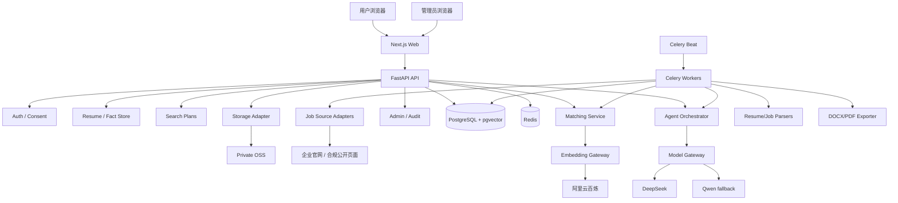
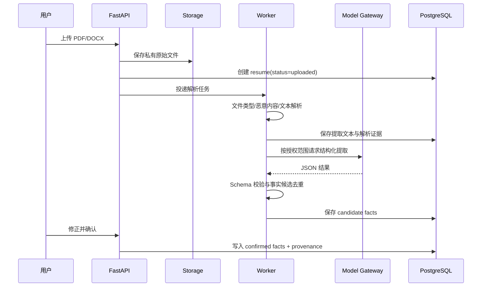

# 02. 系统架构

## 1. 架构原则

第一版采用“模块化单体 + 独立后台任务进程”，不拆分微服务。边界通过 Python 包、数据库表所有权和内部接口保持清晰，部署仍由一套 Docker Compose 管理。

核心原则：

- 确定性业务优先，LLM 不直接决定硬条件、权限或数据删除。
- 外部来源和模型均通过 Adapter/Gateway 隔离。
- 所有长任务异步、幂等、可观察、有限重试。
- 原始证据与派生结论分开保存。
- 本地、CI、云端使用相同迁移和容器镜像。

## 2. 技术栈基线

| 层 | 选择 | 说明 |
|---|---|---|
| Web | Next.js + React + TypeScript | 响应式页面、简历编辑器、管理后台 |
| API | Python + FastAPI + Pydantic | REST API、鉴权、业务编排 |
| ORM/迁移 | SQLAlchemy + Alembic | PostgreSQL 数据访问与迁移 |
| 数据库 | PostgreSQL + pgvector | 业务数据、全文元数据、向量 |
| 队列 | Celery + Redis | 采集、解析、模型、导出、清理任务 |
| Agent | LangGraph | AI 助手、多 Agent、人工确认与恢复 |
| 文件 | 本地兼容存储 Adapter / 阿里云 OSS | 开发与云端统一接口 |
| 邮件 | Mailpit（本地）/ 合规邮件服务（Beta） | 免密登录 |
| 模型 | DeepSeek 主模型、Qwen 备用 | 统一 Model Gateway |
| Embedding | 阿里云百炼 | 统一 Embedding Gateway |
| 测试 | pytest、Playwright、前端测试工具 | 单元、集成、E2E、评测 |

具体版本在实施阶段选择当时仍受维护的稳定版本，写入锁文件，并在升级前运行完整评测。不得在设计文档中假设“latest”永远兼容。

## 3. 逻辑组件



## 4. 后端模块建议

```text
backend/
  app/
    api/                 # REST 路由和 DTO
    auth/                # magic link、邀请码、会话、RBAC
    consents/            # 第三方授权和版本化告知
    resumes/             # 文件、解析、事实、版本、导出
    search_plans/        # 求职方案与偏好
    companies/           # 公司标准化、关注、屏蔽
    jobs/                # 来源、采集、标准化、去重、有效性
    matching/            # 硬规则、召回、评分、解释
    agents/              # LangGraph 状态图和工具
    learning/            # 受控免费资源库
    notifications/       # 站内通知
    analytics/           # 匿名产品事件
    admin/               # 后台、运行状态、成本
    privacy/             # 导出、删除、保留策略
    audit/               # 不可变审计事件
    integrations/        # DeepSeek、Qwen、百炼、OSS、邮件
    tasks/               # Celery 任务和调度
    core/                # config、errors、security、logging
```

模块不得直接导入供应商 SDK 到业务层；所有第三方调用必须经过 `integrations` 中的端口与适配器。

## 5. 关键运行流程

### 5.1 简历处理



### 5.2 岗位推荐

1. Celery Beat 每天触发来源任务。
2. Source Adapter 保存不可变原始快照及来源元数据。
3. Normalizer 输出统一 JobPosting。
4. Deduplicator 合并为 CanonicalJob，保留多个 SourceOccurrence。
5. HardFilter 针对每个求职方案生成候选。
6. Embedding/pgvector 召回语义相关岗位。
7. Scorer 计算分项与总分，EvidenceBuilder 绑定证据。
8. 前 20 个新岗位写入 Recommendation。
9. 账号级前 3 个进入自动多 Agent 队列。

### 5.3 多 Agent 与人工确认

LangGraph 只负责编排模型步骤和审批断点。所有工具先进行用户、资源、授权和配额检查。事实写入、最终简历创建、删除等操作必须产生 `pending_action`，由 API 接受用户确认后恢复执行。

## 6. 本地与云端拓扑

### 6.1 本地

- Docker：PostgreSQL/pgvector、Redis、Mailpit、可选 MinIO。
- 主机或容器热更新：FastAPI、Celery、Next.js。
- 对象存储默认使用本地兼容 Adapter；OSS 集成测试需显式启用。
- 所有真实 API 调用由 feature flag 和预算上限保护。

### 6.2 阿里云封闭 Beta

- 单台 Linux ECS 运行反向代理、Web、API、Worker、Beat、PostgreSQL、Redis。
- 私有 OSS 保存简历与导出文件。
- HTTPS、自动续期证书、只开放 80/443；数据库和 Redis 不暴露公网。
- 每日加密备份到独立 OSS 前缀，并定期执行恢复演练。

单机部署是 Beta 的成本选择，不等于高可用。生产扩容时优先拆分 PostgreSQL、Redis 和 Worker。

## 7. 健康与就绪

| 端点 | 含义 |
|---|---|
| `/health/live` | 进程能响应，不检查外部依赖 |
| `/health/ready` | 数据库、Redis、迁移版本、存储可用 |
| `/health/capabilities` | 岗位来源、DeepSeek、Qwen、Embedding、导出能力的独立状态 |

服务“存活”不能代表岗位来源或 AI 能力可用。管理员后台必须展示能力矩阵，并允许单独禁用故障能力。

## 8. 故障和重试

- 所有任务有稳定 idempotency key。
- 外部调用使用超时、指数退避、抖动和最大重试次数。
- JSON/Schema 不合格视为失败，不允许用空字段伪装成功。
- 配额不足、未授权和来源禁止访问属于不可重试错误。
- Dead-letter 任务进入管理员队列，不能无限重放。
- 模型失败时返回基础匹配；禁止让整个推荐页面不可用。

## 9. 架构决策记录（ADR）要求

以下变更必须新增 ADR：

- 新模型或新第三方数据接收方。
- 新岗位来源或自动化访问方式。
- 数据保留、授权、导出、删除规则变化。
- 从单机拆分托管服务。
- 修改评分权重、阈值或受保护属性规则。
- 扩大 Agent 写操作权限。
