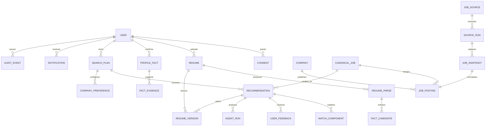

# 03. 数据模型与生命周期

## 1. 设计约束

- 主键统一使用 UUID/ULID，外部 ID 不能作为内部主键。
- 所有时间使用 UTC 存储，界面转换为 Asia/Shanghai。
- 原始来源、解析结果、用户确认事实和 AI 派生结论分层保存。
- 软删除只用于 7 天账号恢复期；到期执行物理清理任务。
- 审计日志不得包含简历正文、聊天正文或模型完整输入输出。

## 2. 实体关系

## 3. 账号、授权与访问

### `users`

- `id`, `email_normalized`, `role`, `status`
- `age_attested_at`, `terms_version`, `privacy_version`
- `last_active_at`, `deletion_requested_at`, `purge_after`
- `created_at`, `updated_at`

约束：没有 `age_attested_at` 不得上传简历；`status=deletion_pending` 时停止新处理。

### `invites`

- `code_hash`, `max_uses`, `used_count`, `expires_at`, `disabled_at`
- 只保存哈希，不保存可直接使用的邀请码。

### `auth_tokens` / `sessions`

- magic link token 只保存哈希，短时、单次使用。
- 会话支持撤销、轮换和设备列表。

### `consents`

- `user_id`, `provider`（deepseek/qwen/analytics/support）
- `scope`（full_resume/deidentified/profile_fields 等）
- `notice_version`, `purpose`, `data_categories`
- `granted_at`, `revoked_at`, `expires_at`

约束：不同模型服务商必须分别授权；撤回后新任务立即拒绝完整数据调用。

### `support_access_grants`

- `user_id`, `resume_id`, `admin_id`, `reason`
- `granted_at`, `expires_at`, `revoked_at`, `accessed_at`

默认不存在；必须由用户发起且限时。

## 4. 简历与事实

### `resumes`

- `user_id`, `storage_key`, `original_filename`, `media_type`, `size_bytes`
- `sha256`, `status`, `uploaded_at`, `deleted_at`
- `malware_scan_status`, `text_extract_status`

### `resume_parses`

- `resume_id`, `parser_name`, `parser_version`, `model_provider`, `model_version`
- `extracted_text_storage_key`, `schema_version`, `status`, `error_code`
- `started_at`, `completed_at`

### `fact_candidates`

- `resume_parse_id`, `fact_type`, `value_json`
- `source_span_start`, `source_span_end`, `source_quote_hash`
- `confidence`, `status`（pending/accepted/rejected/edited）

### `profile_facts`

- `user_id`, `fact_type`, `value_json`, `status`
- `provenance_type`（resume/user_answer/import）
- `confirmed_by_user_at`, `superseded_by_id`

禁止没有来源和确认记录的事实进入定制简历。

### `fact_evidence`

- `profile_fact_id`, `resume_id`, `source_locator`
- `evidence_hash`, `display_excerpt`（最小必要片段）

### `resume_versions`

- `user_id`, `kind`（plan_base/job_tailored）
- `search_plan_id`, `canonical_job_id`, `parent_version_id`
- `content_json`, `template_id`, `status`
- `created_by`（user/agent_draft）, `confirmed_at`

## 5. 求职方案与偏好

### `search_plans`

- `user_id`, `name`, `role_family`, `status`, `priority`
- `city_codes[]`, `work_modes[]`
- `minimum_monthly_salary`, `target_monthly_salary`, `salary_months_preference`
- `minimum_match_score`（默认 65）
- `allow_outsourcing`（默认 false）
- `base_resume_version_id`

每用户最多 3 个 active 方案，由数据库约束或事务锁保证。

### `company_preferences`

- `search_plan_id`, `company_id`, `preference`（follow/priority/block）
- 屏蔽优先级高于关注和算法分数。

### `learned_preferences`

- 从显式反馈派生，不覆盖用户直接配置。
- 必须支持一键重置和版本化。

## 6. 岗位来源与标准化

### `job_sources`

- `name`, `source_type`, `base_url`, `status`
- `access_policy_url`, `robots_checked_at`, `terms_checked_at`
- `rate_limit_config`, `capabilities_json`

### `source_runs`

- `job_source_id`, `run_key`, `status`
- `started_at`, `completed_at`, `items_seen`, `items_new`, `items_failed`
- `error_code`, `next_retry_at`

### `job_snapshots`

- 不可变原始证据：`source_url`, `fetched_at`, `content_hash`
- 原始内容放对象存储；数据库保存 key 和校验值。
- 不允许人工 SQL 直接修改原始快照。

### `companies`

- `canonical_name`, `aliases[]`, `official_domain`, `city_codes[]`
- `verification_status`, `source_refs_json`

### `job_postings`

- `source_id`, `source_job_id`, `canonical_job_id`, `company_id`
- `title_raw`, `title_normalized`, `role_family`
- `description_text`, `city_code`, `work_mode`, `employment_type`
- `salary_min`, `salary_max`, `salary_months`, `salary_unknown`
- `experience_min`, `experience_max`, `education_requirement_type`
- `published_at`, `first_seen_at`, `last_seen_at`, `expires_at`, `status`
- `source_url`, `snapshot_id`

### `canonical_jobs`

- 合并后的岗位主体；保留 `dedupe_version` 和 `dedupe_confidence`。
- 企业官网来源优先作为主展示源，但不能删除其他来源。

## 7. 匹配、反馈和 Agent

### `recommendations`

- `search_plan_id`, `canonical_job_id`, `score_total`, `grade`
- `hard_filter_status`, `scoring_version`, `rank`, `recommended_on`
- 唯一约束：同一方案、岗位、日期不能重复生成。

### `match_components`

- `recommendation_id`, `component`, `score`, `weight`
- `evidence_refs_json`, `gap_level`, `uncertainty`

### `user_feedback`

- `recommendation_id`, `sentiment`（interested/not_interested）
- `reason_code`, `optional_note`, `created_at`
- note 不是匿名分析事件，不得直接发送第三方分析平台。

### `agent_runs`

- `recommendation_id`, `trigger`（auto/manual）
- `graph_version`, `provider`, `model_map_json`
- `status`, `current_stage`, `started_at`, `completed_at`
- `input_fingerprint`, `output_schema_version`, `final_report_json`
- `cost_tokens_in`, `cost_tokens_out`, `cost_amount`

不保存模型思维链。仅保存结构化最终结果、必要的供应商请求 ID、错误码和校验状态。

### `pending_actions`

- `agent_run_id`, `action_type`, `payload_json`, `status`
- `requested_at`, `expires_at`, `approved_at`, `rejected_at`
- 写事实、创建最终版本、删除等必须使用该表。

## 8. 通知、任务、费用与审计

### `notifications`

- `user_id`, `type`, `title`, `body_safe`, `entity_ref`, `read_at`
- `body_safe` 不得包含简历正文和敏感事实。

### `task_runs`

- `task_type`, `idempotency_key`, `status`, `attempt_count`
- `scheduled_at`, `started_at`, `completed_at`, `error_code`

### `usage_ledger`

- `user_id`, `provider`, `model`, `operation_type`
- `tokens_in`, `tokens_out`, `amount_estimated`, `occurred_at`
- 用于账号限额与全局预算熔断。

### `audit_events`

- `actor_type`, `actor_id`, `action`, `resource_type`, `resource_id`
- `result`, `reason_code`, `ip_hash`, `created_at`
- append-only；严禁正文、密钥和完整请求体。

## 9. 保留与删除矩阵

| 数据 | 默认保留 | 用户删除/注销 |
|---|---|---|
| 原始简历与解析文本 | 活跃账号期间；长期不活跃清理 | 7 天恢复期后删除 OSS 和 DB 引用 |
| 结构化事实与简历版本 | 活跃账号期间 | 7 天后物理删除 |
| 聊天记录 | 90 天，可随时删除 | 注销清理 |
| 岗位公开快照 | 按来源政策与审计必要性 | 与用户注销无关，但不得含用户信息 |
| 匿名产品指标 | 聚合后保留 | 删除可关联用户的原始事件 |
| 授权记录 | 服务期间及必要审计期 | 保留最小撤回/授权证据，正文删除 |
| 备份 | 建议 30 天滚动 | 到期自然清除，禁止恢复回生产 |

长期不活跃建议定义为连续 180 天未登录，清理前必须站内告知；Beta 只有站内通知，因此应在用户再次登录时明确展示即将清理状态。

## 10. 数据导出

导出 ZIP 至少包含：

- `profile.json`
- `search-plans.json`
- `facts.json`
- `feedback.json`
- `consents.json`
- 原始简历及已保存 DOCX/PDF 版本

导出前重新验证会话，任务异步执行，下载链接短时有效，下载完成或过期后删除临时文件。
