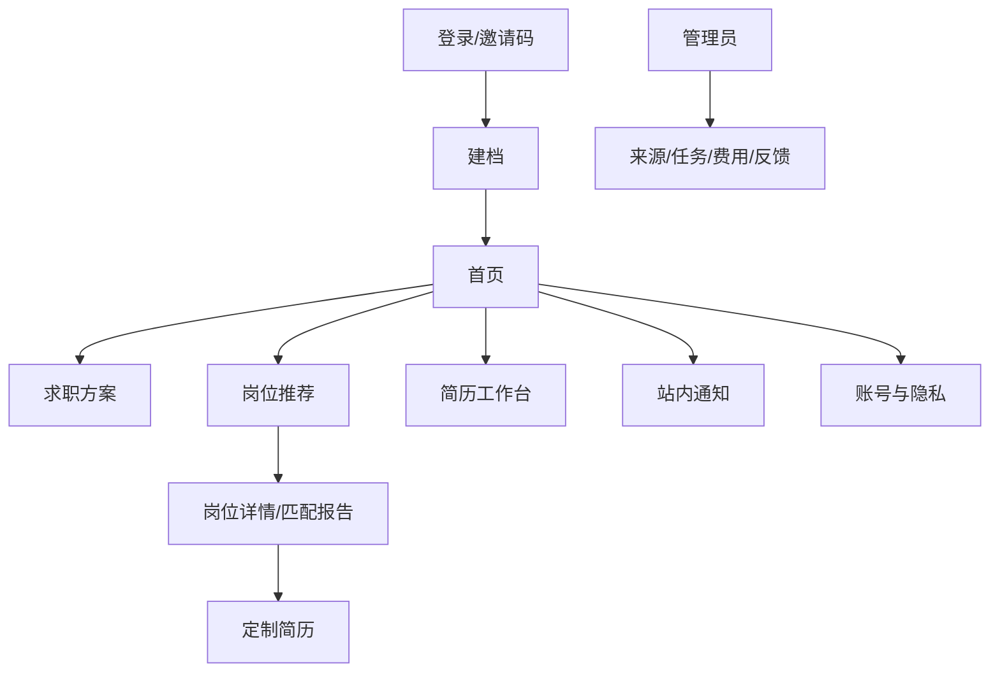

# 05. 页面与交互规格

## 1. 体验原则

- 专业、简洁、可信，不使用夸大的“录用概率”或“AI 保证”。
- 先展示结论和证据，再展示技术细节。
- 手机端适合浏览与反馈，桌面端适合编辑与对比。
- 高风险操作必须明确确认；普通只读操作无需频繁弹窗。
- 多 Agent 只展示总体状态和最终汇总，不展示内部对话或思维链。

## 2. 信息架构



## 3. 路由建议

| 路由 | 页面 |
|---|---|
| `/login` | 邀请码和邮箱免密登录 |
| `/onboarding` | 年龄确认、上传、授权、档案确认、首个方案 |
| `/dashboard` | 今日推荐、任务状态、方案概览、费用/额度摘要 |
| `/plans` | 求职方案列表 |
| `/plans/{id}` | 方案设置、公司偏好、基础简历 |
| `/recommendations` | 每日推荐列表 |
| `/recommendations/{id}` | 岗位、分数、证据、风险、学习资源 |
| `/resumes` | 原始简历、事实库、基础版、定制版 |
| `/resumes/versions/{id}` | 简历编辑器与差异 |
| `/notifications` | 站内通知 |
| `/settings/account` | 会话、导出、注销 |
| `/settings/privacy` | 服务商授权、聊天保留、管理员支持授权 |
| `/legal/*` | 用户协议、隐私政策、第三方说明 |
| `/admin/*` | 管理员后台 |

## 4. 首次建档

采用明确的步骤条：

1. 年龄与协议。
2. 上传 PDF/DOCX。
3. 选择模型处理范围。
4. 等待解析并检查失败状态。
5. 用户逐类确认事实。
6. 填写简历中没有的城市、薪资、办公方式。
7. 创建求职方案。

完整简历授权不得使用默认勾选、模糊按钮或把拒绝隐藏在二级页面。拒绝完整上传时提供脱敏/本地规则的可用路径。

## 5. 首页线框图

```text
┌──────────────────────────────────────────────────────────┐
│ CareerCopilot   今日推荐   简历   通知   账号             │
├──────────────────────────────────────────────────────────┤
│ 求职方案：AI应用开发 ▼      今日额度：深度 2/6 简历 1/3 │
├──────────────────────────────────────────────────────────┤
│ 今日新岗位 20   高匹配 6   可尝试 14   待处理任务 1      │
├──────────────────────────────────────────────────────────┤
│ [92 高匹配] AI应用工程师 · 北京 · 25-40K                │
│ 匹配：RAG / FastAPI / PostgreSQL                          │
│ 缺口：Kubernetes      风险：无明显风险                    │
│ [查看报告] [感兴趣] [不感兴趣]                            │
├──────────────────────────────────────────────────────────┤
│ 系统状态：岗位数据更新于 08:00；DeepSeek 正常             │
└──────────────────────────────────────────────────────────┘
```

## 6. 推荐列表

必须支持：方案、城市、等级、公司、办公方式、是否深度分析筛选。卡片显示：

- 岗位名称、公司、城市、办公方式。
- 薪资范围与薪数；缺失时显示“未披露”。
- 发布时间/首次发现时间和主来源。
- 总分、等级、前三个匹配点、最关键缺口。
- 风险徽标和外包判断不确定性。
- 感兴趣/不感兴趣动作。

不得在列表中显示虚假的公司评分或无法解释的精确概率。

## 7. 岗位详情与最终报告

页面区域：

1. 原始岗位信息与全部来源链接。
2. 硬条件结果。
3. 总分与分项分数。
4. 匹配证据（简历事实 ↔ 岗位原文）。
5. 关键缺口与影响。
6. 风险信号与原文证据。
7. 免费学习资源。
8. 多 Agent 最终汇总。
9. 生成岗位定制简历。

异步深度分析只显示 `排队中 → 分析中 → 校验中 → 已完成/失败`。失败时保留基础匹配，提供清晰重试条件。

## 8. 简历事实确认

按个人概况、技能、工作、项目、教育分组。每条候选事实显示原始证据片段和以下动作：接受、编辑后接受、拒绝。

新增量化成果时使用问题卡：

```text
AI 建议补充：接口优化前后响应时间分别是多少？
[我知道，填写数据] [无法确认，不添加]
```

不得提供“帮我估算”按钮。

## 9. 简历编辑器

桌面端三栏或两栏：

- 左：章节导航与事实库。
- 中：标准单栏简历预览/编辑。
- 右：逐项修改、理由、岗位证据、接受/拒绝。

移动端只支持轻量修改和确认，复杂排版提示用户使用桌面端。导出前执行事实一致性检查和版面预览。

## 10. AI 助手

以侧边栏出现，可执行：解释推荐、搜索当前用户岗位、解释缺口、提出事实补充问题、生成草稿和创建待确认动作。

工具动作展示为明确卡片。读取无需确认；写事实、创建最终简历或删除动作必须显示影响范围并确认。

## 11. 反馈与站内通知

“不感兴趣”原因至少包括：

- 地点
- 薪资
- 公司
- 技术方向
- 岗位内容
- 经验/学历要求
- 外包/派遣
- 风险顾虑
- 已看过/重复

“感兴趣”岗位进入可筛选列表，但不演变为申请进度管理。

通知类型：新推荐、深度分析完成、简历导出完成、数据导出完成、来源/能力降级提示、账号清理提醒。

## 12. 管理后台

首页展示：

- 今日采集量、去重率、有效岗位数。
- 来源成功率和最近一次成功时间。
- 模型/Embedding 调用量、费用和错误率。
- 队列积压、死信任务。
- 匿名推荐指标和反馈分布。

用户列表不得展示简历摘要。支持授权访问时，必须先展示授权范围和到期时间，并产生审计事件。

## 13. 响应式与可访问性

- 触控目标、键盘导航、焦点状态和表单错误必须可用。
- 颜色不是分数/风险的唯一表达方式。
- 图表提供文本摘要。
- 主要流程在常见手机宽度无横向滚动。
- DOCX/PDF 预览失败时提供下载和纯文本替代。

## 14. 空状态与错误状态

- 无岗位：解释是来源暂无数据、硬条件过严还是能力降级，并允许调整方案。
- 模型不可用：展示基础匹配，说明深度分析稍后完成。
- 来源受限：提供原平台搜索入口和用户导入。
- 授权缺失：说明发送对象、数据和目的，拒绝不阻断基础功能。
- 分析无证据：不得生成结论，显示“信息不足”。
