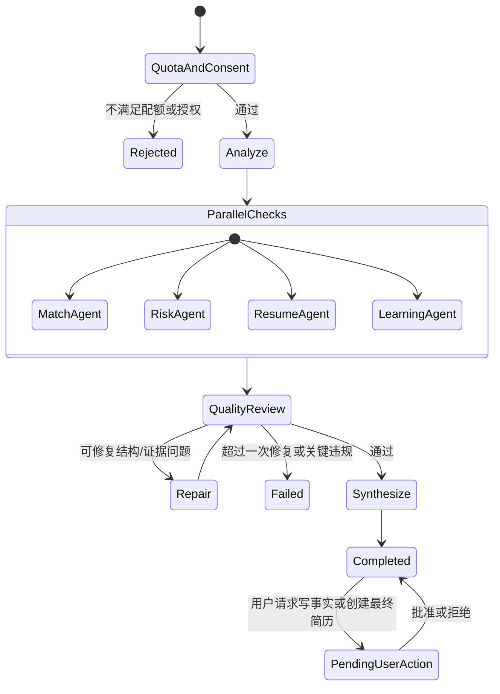

# 07. 匹配、模型与多 Agent 规格

## 1. 总体原则

推荐系统由四层组成：

1. 确定性硬条件。
2. 向量召回。
3. 可校准综合评分。
4. AI 解释与多 Agent 深度分析。

LLM 不得直接覆盖硬条件结果，也不得把没有证据的推断写成用户事实。

## 2. 硬条件

按求职方案执行：

- 城市与办公方式中的“必须”条件。
- 最低可接受薪资；薪资缺失/面议进入不确定队列，不自动伪造通过。
- 只支持全职。
- 外包/派遣/驻场默认排除，除非用户开启。
- 屏蔽公司。
- 学历明确 required 且用户不满足时过滤。
- 经验差距过大过滤；差 1 年以内允许降分进入。

每项硬条件必须返回 `passed/failed/unknown` 和证据，不能只有布尔值。

## 3. 向量召回

- 使用阿里云百炼 Embedding，经统一 Gateway 调用。
- 简历向量基于已确认事实和求职方案基础版本，不直接嵌入联系方式。
- 岗位向量基于标准标题、职责、要求和技能。
- 向量、模型 ID、维度、预处理版本一起保存。
- 更换 Embedding 模型必须新建索引/版本并跑离线评测，禁止新旧向量混用。

向量只用于召回和语义特征，不单独决定最终分数。

## 4. 综合评分初始方案

初始权重在 60 组人工标注后校准：

| 维度 | 初始权重 | 说明 |
|---|---:|---|
| 核心技能 | 35 | 必需技能、技能深度、相近技能迁移 |
| 工作经验 | 20 | 年限、职责相似度、复杂度 |
| 项目证据 | 20 | 可验证项目与岗位职责的对应关系 |
| 岗位方向语义 | 10 | 职位族和发展方向 |
| 行业/业务背景 | 5 | 仅在岗位明确需要时 |
| 用户偏好 | 10 | 目标薪资、办公方式、公司偏好、显式反馈 |

总分为 0～100 的排序分：

- 80～100：`high`
- 65～79：`potential`
- <65：`low`，默认隐藏

风险信号不直接混入能力匹配分，应单独展示；严重且确定的收费/非法信号可触发安全过滤。

## 5. 证据结构

每个匹配项至少包含：

```json
{
  "claim": "具备 FastAPI 后端开发经验",
  "profile_fact_ids": ["fact_..."],
  "job_evidence": {"snapshot_id": "...", "span": "..."},
  "strength": "strong",
  "uncertainty": null
}
```

找不到证据时必须返回 `insufficient_evidence`，禁止以模型常识补足。

## 6. 公平性和不应使用的特征

以下内容不得进入召回、评分或个性化：

- 性别、年龄、照片、婚育状况。
- 民族、宗教、籍贯。
- 与工作能力无关的健康或身份信息。

岗位中出现相关限制时，风险 Agent 只标记潜在歧视信号和原文证据。不得因为用户“符合”歧视条件而提高分数。

## 7. 模型分工

### 7.1 主路径

- DeepSeek：标准岗位分析、多 Agent、简历草稿、最终质量审查。
- 通义千问：DeepSeek 不可用时备用；离线对照评测。
- 阿里云百炼：Embedding。

### 7.2 模型分级

- 快速/低成本档：抽取、风险初筛、标准分析。
- 高质量档：协调汇总、质量审查、复杂简历改写。
- 具体模型 ID 通过配置和 allowlist 管理。
- 升级先跑固定评测集、成本和延迟对比，审批后切换。

### 7.3 Model Gateway

统一接口必须支持：

- 供应商授权检查和数据范围构造。
- JSON Schema 结构化输出与二次校验。
- 超时、最大 token、有限重试和熔断。
- 请求指纹、供应商 request ID、模型版本和费用账本。
- 不把提示词、简历正文或模型响应写入普通日志。
- DeepSeek → Qwen 备用切换前重新检查 Qwen 独立授权。

## 8. 多 Agent 工作流

### 8.1 角色

| Agent | 输入 | 输出 | 禁止 |
|---|---|---|---|
| 匹配分析 | 已确认事实、岗位快照、规则分 | 匹配证据、关键缺口 | 修改硬条件或事实 |
| 岗位风险 | 岗位文本、来源、公司公开信息 | 风险信号、证据、置信度 | 宣布公司违法/诈骗 |
| 简历优化 | 事实库、岗位、基础简历 | 修改草稿和理由 | 发明技能、数字、经历 |
| 学习资源 | 缺失技能、受控资源库 | 免费资源条目 | 自由生成网址、推荐付费内容 |
| 质量审查 | 上述结构化输出、事实与证据 | 通过/退回、冲突和违规项 | 添加新业务结论 |
| 协调器 | 已通过或已标记结果 | 最终统一报告 | 执行写操作 |

### 8.2 状态图



修复循环最多 1 次；不得让 Agent 无限互评消耗费用。

### 8.3 触发与限额

- 每个账号每天自动深度分析 3 个岗位。
- 用户每天额外手动触发 3 次。
- 自动名额由用户指定优先求职方案；未指定时按方案优先级轮转。
- 账号连续不活跃时停止自动深度分析。
- 全局费用达到告警/熔断阈值时停止自动任务，保留基础匹配。

### 8.4 用户可见结果

用户只看到最终结构化报告，不看到 Agent 内部对话、系统提示词或思维链。进度只显示“排队、分析、校验、完成/失败”。

## 9. AI 助手工具权限

允许工具：

- 查询当前用户的推荐、方案、事实和简历版本。
- 运行只读搜岗/筛选。
- 解释已有分数、证据和风险。
- 生成草稿。
- 创建待确认动作。

禁止工具：

- 任意 SQL、任意 URL、shell、文件系统。
- 直接写入 `profile_facts`。
- 绕过额度、授权和硬条件。
- 删除用户数据。
- 登录招聘平台或执行投递。

## 10. 简历事实安全

- 改写只能改变表达、排序和突出重点。
- 数字、技能、项目、雇主、任职时间必须引用事实 ID。
- 缺失数字时生成问题，不生成估算。
- 用户回答先成为 `fact_candidate`，确认后再进入事实库。
- 导出前执行一次确定性引用校验和一次质量审查。
- 发现冲突时阻止导出并提示用户选择正确事实。

## 11. 免费学习资源

资源库由管理员维护：技能、标题、URL、语言、来源类型、难度、最后检查时间、有效状态。优先官方文档、官方教程、可信开源课程和开源项目。

Agent 只能检索资源库，不能自行拼接链接。失效资源不返回；所有资源明确为免费。

## 12. 降级

| 故障 | 行为 |
|---|---|
| DeepSeek 失败、Qwen 已授权 | 尝试一次 Qwen 备用 |
| DeepSeek 失败、Qwen 未授权 | 返回规则 + 向量基础结果，任务稍后重试 |
| Embedding 不可用 | 使用已有向量；新内容暂不进入语义召回 |
| Agent 子步骤失败 | 不伪装完整报告；基础结果可见 |
| Schema 校验失败 | 最多一次结构修复，仍失败则明确失败 |
| 预算熔断 | 停止自动深度分析，保留用户可见状态 |

## 13. 评测版本化

必须记录 `hard_rule_version`、`embedding_version`、`scoring_version`、`graph_version`、`prompt_version`、`model_version` 和 `output_schema_version`。没有版本链的线上分数不得用于回归比较。
